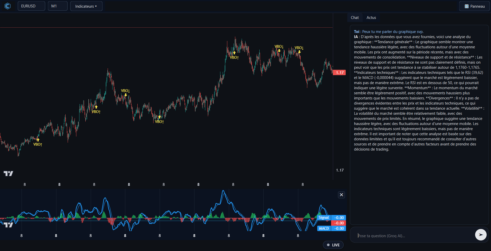

## 📸 Aperçu de l’application



# 🚀 Trading App

Application de trading temps réel en **Python (PyQt6)**, reliée à **MetaTrader 5** et à l’**IA Groq**.  
Elle affiche un **chart interactif** (EMA, RSI, MACD, signaux personnalisés) et un **panel IA** pour analyser tes données de marché.

---

## ⚙️ Installation

Clone le repo et installe les dépendances :

```bash
git clone git@github.com:Alxc-git/trading-app.git
cd trading-app
pip install -r requirements.txt
```
-----------------------------------------------
🔑 Configuration .env

1️⃣ Créez le fichier .env

Linux / macOS :
```
echo "MT5_LOGIN=" >> .env
echo "MT5_PASSWORD=" >> .env
echo "MT5_SERVER=" >> .env
echo "GROQ_DEBUG=1" >> .env
echo "GROQ_API_KEY=" >> .env
```

Windows PowerShell :
```
New-Item -Path . -Name ".env" -ItemType "file" -Force
Add-Content .env "MT5_LOGIN="
Add-Content .env "MT5_PASSWORD="
Add-Content .env "MT5_SERVER="
Add-Content .env "GROQ_DEBUG=1"
Add-Content .env "GROQ_API_KEY="
```

2️⃣ Remplissez les champs

Exemple .env (⚠️ valeurs fictives) :
```
# --- MetaTrader 5 credentials ---
MT5_LOGIN=12345678
MT5_PASSWORD=MonSuperMotDePasse
MT5_SERVER=MetaQuotes-Demo

# --- Groq API ---
# Active le mode debug (logs supplémentaires dans la console)
GROQ_DEBUG=1
# Clé API générée depuis https://console.groq.com
GROQ_API_KEY=gsk_demo_1234567890abcdef
```

3️⃣ Ajoutez .env dans .gitignore
```
.env
```

🖥️ Lancement

Démarrez l’application avec :
```
python main.py
```
ou
```
py -3.13 main.py
```
